🍽️ FoodHub

<p align="center">
  <strong>A Role-Based Online Food Ordering System built with Core PHP & MySQL</strong>
</p>

<p align="center">
  FoodHub connects Customers, Restaurants, and Administrators in one web application.
</p>

<p align="center">
  
  
  
  
</p>

📖 About the Project

FoodHub is a role-based food ordering web application developed using Core PHP, PDO, MySQL, HTML, CSS, Bootstrap, and JavaScript.

The application provides separate functionality for three roles:

Role

Main Responsibilities

👤 Customer

Browse food, manage cart and wishlist, checkout, place orders, and view order history

🏪 Restaurant

Manage restaurant profile, manage food items, view customer orders, and update order status

🛡️ Admin

Manage restaurants, review food requests, approve/reject food, and view platform orders

✨ Features

👤 Customer Module

🔐 User registration and login

🍔 Browse available food items

🛒 Add and manage cart items

❤️ Wishlist management

💳 Checkout

💵 Cash on Delivery (COD)

💳 Razorpay payment flow

📦 Place food orders

📋 View order history

🔎 View order details

👤 View and edit profile

🔑 Password reset workflow

🏪 Restaurant Module

🔐 Restaurant-owner login

🏪 Complete and manage restaurant profile

📊 Restaurant dashboard

➕ Add food items

✏️ Edit food items

🗂️ Manage food items

⏳ View pending food items

📦 View customer orders

🔎 View complete order details

👤 View customer and delivery information

💳 View payment information

🔄 Update order status

Restaurant Order Status Flow

Pending
   │
   ├──────────────► Cancelled
   │
   ▼
Confirmed
   │
   ▼
Delivered

🛡️ Admin Module

📊 Admin dashboard

➕ Add restaurants

🏪 Manage restaurants

🔄 Activate / deactivate restaurants

🍔 View restaurant food items

⏳ View food requests

✅ Approve food items

❌ Reject food items

📦 View platform orders

🛠️ Technology Stack

Category

Technology

Frontend

HTML5, CSS3, Bootstrap 5.3.3, JavaScript

Icons

Bootstrap Icons

Backend

Core PHP

Database

MySQL

Database Access

PDO

Payment

Razorpay

Local Server

XAMPP

Version Control

Git & GitHub

🔄 Application Workflow

                         ┌─────────────────┐
                         │     Customer    │
                         └────────┬────────┘
                                  │
                                  ▼
                         ┌─────────────────┐
                         │   Browse Food   │
                         └────────┬────────┘
                                  │
                         ┌────────┴────────┐
                         ▼                 ▼
                    ┌─────────┐      ┌───────────┐
                    │  Cart   │      │ Wishlist  │
                    └────┬────┘      └───────────┘
                         │
                         ▼
                    ┌───────────┐
                    │ Checkout  │
                    └─────┬─────┘
                          │
                    ┌─────┴─────┐
                    ▼           ▼
                  ┌────┐    ┌──────────┐
                  │ COD│    │ Razorpay │
                  └─┬──┘    └────┬─────┘
                    │            │
                    └──────┬─────┘
                           ▼
                    ┌─────────────┐
                    │ Place Order │
                    └──────┬──────┘
                           │
                           ▼
                  ┌──────────────────┐
                  │    Restaurant    │
                  │  Receives Order  │
                  └────────┬─────────┘
                           │
                           ▼
                  Pending → Confirmed
                           │
                           ▼
                       Delivered

🗄️ Database Design

FoodHub uses 9 MySQL tables.

Table

Purpose

users

Stores customer, restaurant-owner, and admin accounts

restaurants

Stores restaurant details and owner relationship

foods

Stores restaurant food items

cart

Stores food items added to customer carts

wishlist

Stores food items saved by customers

orders

Stores customer order, delivery, and payment information

order_item

Stores individual food items belonging to an order

food_images

Stores food image records

password_resets

Stores password-reset information

Database Relationship

users
 │
 ├──────────────► restaurants
 │                     │
 │                     ▼
 │                   foods
 │                     ▲
 │                     │
 ├──────────────► cart ┘
 │
 ├──────────────► wishlist
 │
 └──────────────► orders
                       │
                       ▼
                   order_item
                       │
                       ▼
                     foods

Important Relationships

A user can own a restaurant.

A restaurant can have multiple food items.

A user can have multiple cart and wishlist entries.

A user can place multiple orders.

An order can contain multiple order items.

Each order item references a food item.

Food and restaurant records are connected through restaurant_id.

## 📁 Project Structure

```text
FoodHub/
│
├── admin/
│   ├── add_restaurant.php
│   ├── approve_food.php
│   ├── dashboard.php
│   ├── food_request.php
│   ├── manage_restaurant.php
│   ├── orders.php
│   └── view_restaurant_foods.php
│
├── restaurant/
│   ├── add_food.php
│   ├── complete_profile.php
│   ├── dashboard.php
│   ├── edit_food.php
│   ├── edit_profile.php
│   ├── logout.php
│   ├── manage_food.php
│   ├── order_details.php
│   ├── order_status.php
│   ├── orders.php
│   └── pending_foods.php
│
├── user/
│   ├── cart.php
│   ├── checkout.php
│   ├── dashboard.php
│   ├── edit_profile.php
│   ├── my_orders.php
│   ├── order_success.php
│   ├── profile.php
│   └── wishlist.php
│
├── process/
│   ├── add_food_process.php
│   ├── add_restaurant_process.php
│   ├── cart_process.php
│   ├── login_process.php
│   ├── register_process.php
│   ├── place_order.php
│   ├── update_order.php
│   ├── wishlist_process.php
│   └── ...
│
├── includes/
│   ├── admin_navbar.php
│   ├── footer.php
│   ├── header.php
│   ├── restaurant_navbar.php
│   ├── session.php
│   └── user_navbar.php
│
├── assets/
│   ├── css/
│   │   ├── admin.css
│   │   ├── restaurant.css
│   │   ├── restaurant_dashboard.css
│   │   ├── user.css
│   │   └── ...
│   │
│   └── js/
│       └── script.js
│
├── uploads/
│   ├── foods/
│   ├── profiles/
│   └── restaurants/
│
├── config/
│   └── db.php
│
├── database/
│
├── index.php
├── .gitignore
└── README.md
```

## 🖼️ Screenshots

### 👤 User

| Home | Cart & Checkout |
|---|---|
| 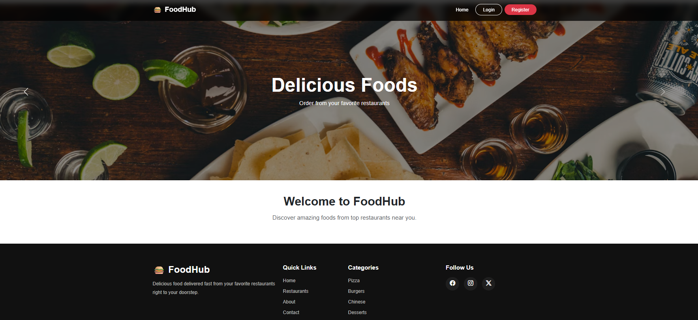 | 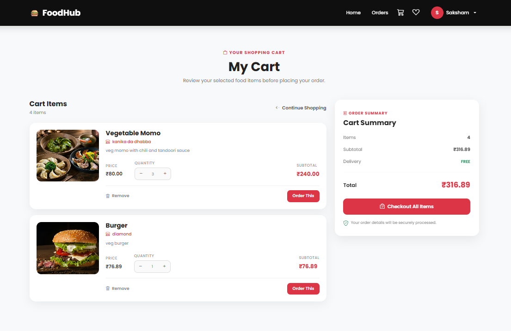 |

| My Orders | Wishlist |
|---|---|
| 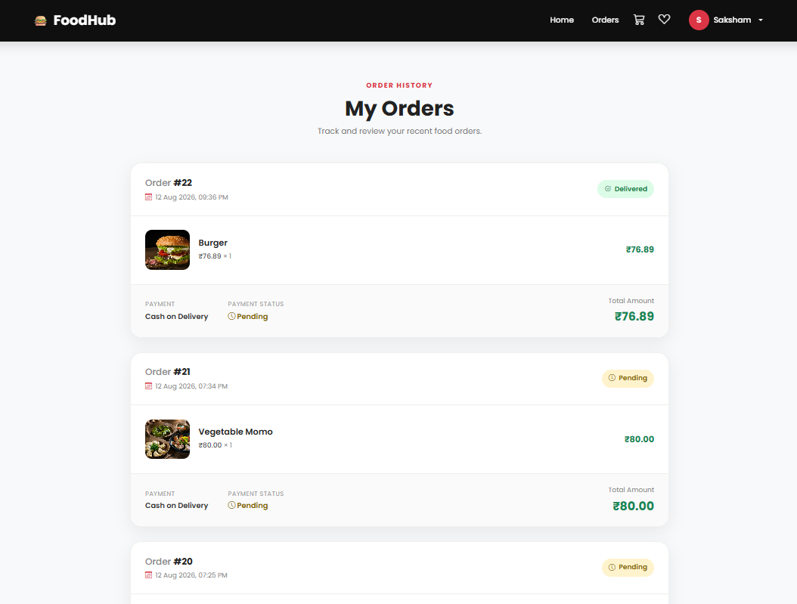 | 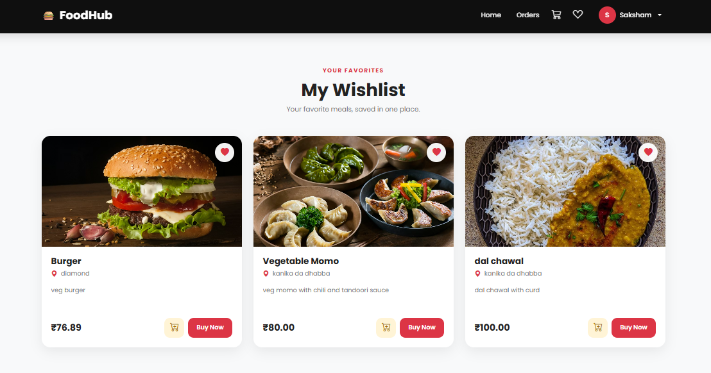 |

---

### 🏪 Restaurant

| Dashboard | Manage Food |
|---|---|
| 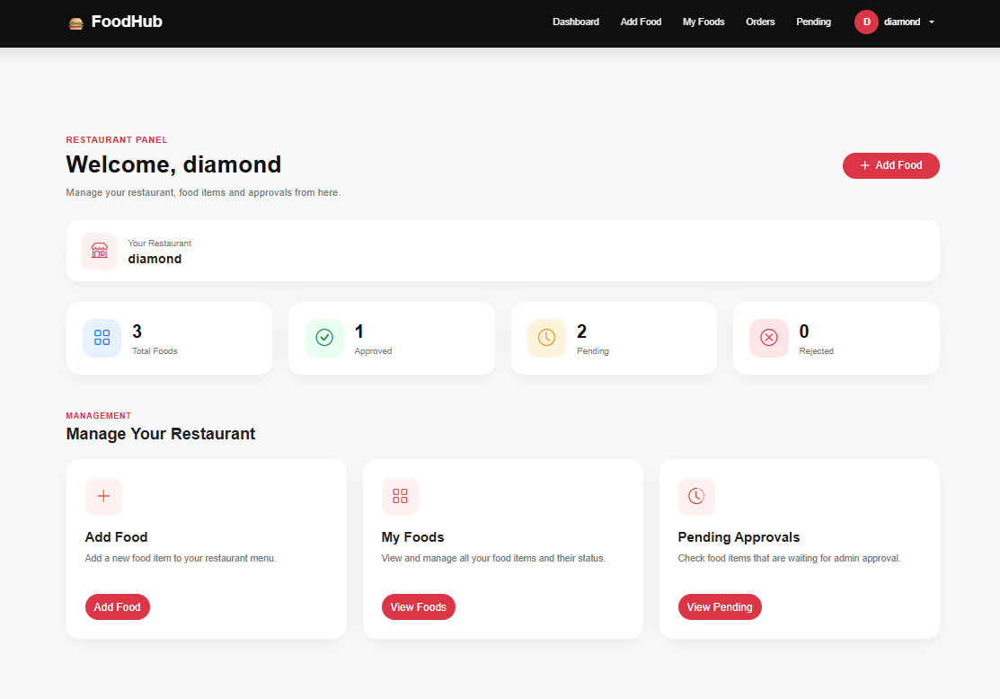 | 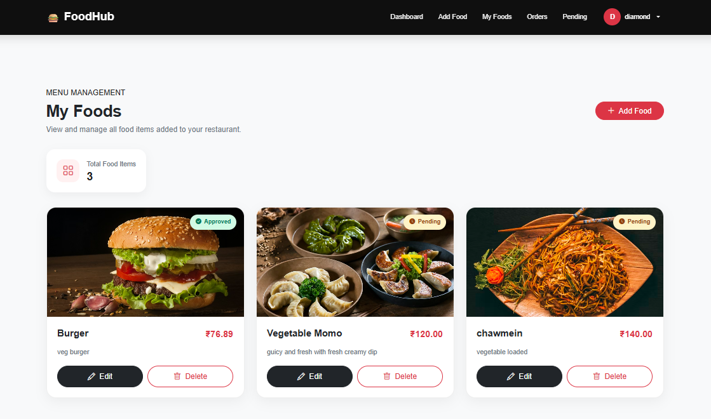 |

| Orders | Order Details |
|---|---|
| 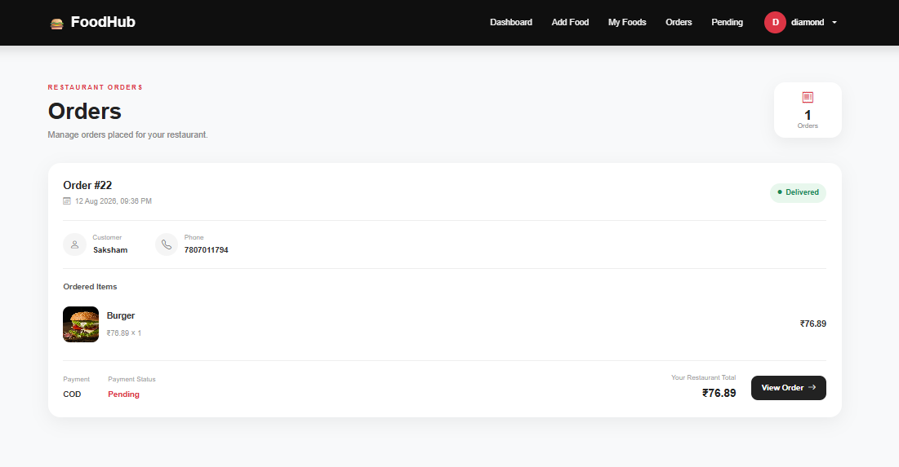 | 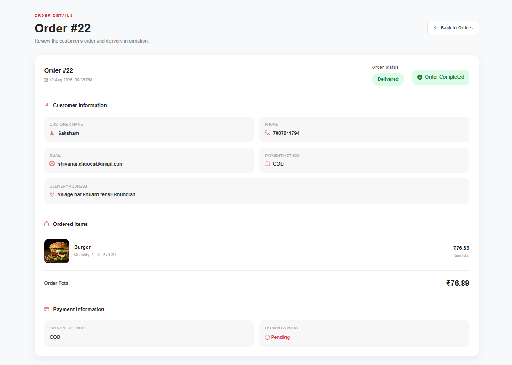 |

---

### 🛡️ Admin

| Dashboard | Manage Restaurants |
|---|---|
| 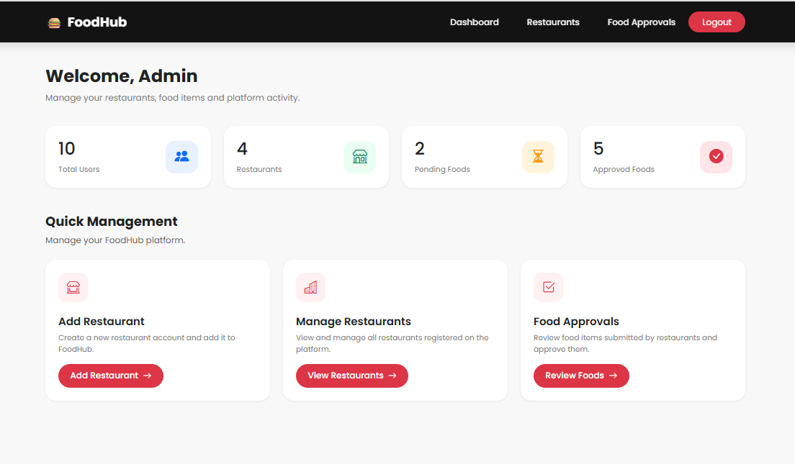 | 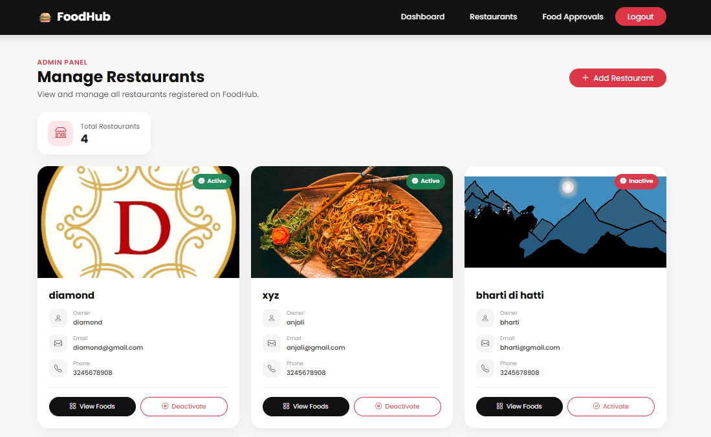 |

| Food Approval | Restaurant View |
|---|---|
| 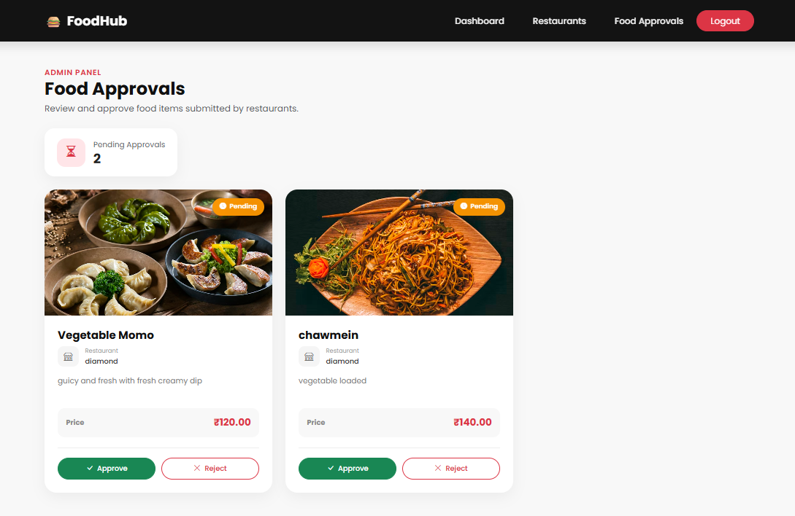 | 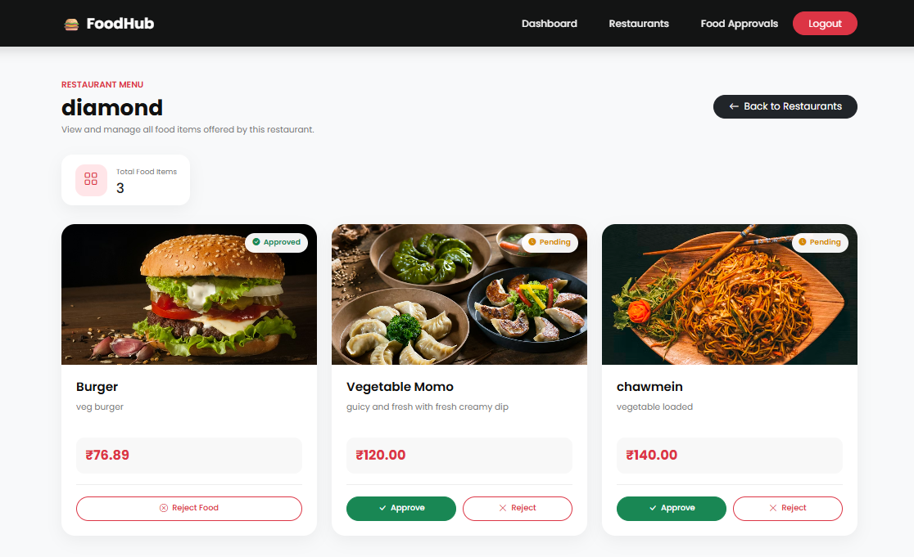 |


🔐 Key Implementation Details

Session-based authentication

Role-based access for Customer, Restaurant, and Admin

Separate dashboards and navigation for each role

PDO prepared statements for database operations

CRUD operations for food and restaurant management

Admin food approval workflow

Cart and wishlist management

Order and order-item management

Restaurant-specific order access

Restaurant order status management

Customer delivery information

COD and Razorpay payment flow

Food and restaurant image uploads

Password reset functionality

Sensitive local configuration excluded through .gitignore

💳 Payment Flow

Cash on Delivery

Checkout
   ↓
Select COD
   ↓
Order Created
   ↓
Order Success

Razorpay

Checkout
   ↓
Select Razorpay
   ↓
Payment Flow
   ↓
Payment Details
   ↓
Order Created

⚠️ Security: Never commit database passwords, SMTP credentials, Razorpay secrets, API keys, or other sensitive credentials to GitHub.

⚙️ Local Setup

Prerequisites

Make sure the following are installed:

XAMPP

Apache

MySQL

PHP

Git

Web browser

1. Clone the Repository

git clone https://github.com/ranashivangi43-maker/FoodHub.git

2. Move the Project

Place the project inside your XAMPP htdocs directory.

Example:

C:\xampp\htdocs\PHP\Restaurant

3. Start XAMPP

Start:

Apache
MySQL

4. Create the Database

Open:

http://localhost/phpmyadmin

Create a database named:

restaurant_project

Import the required database schema into the database.

5. Configure Database Connection

Open:

config/db.php

Configure your local MySQL credentials.

Do not upload real credentials to GitHub.

6. Run the Application

Open:

http://localhost/PHP/Restaurant/

🧪 Testing Workflows

Customer Workflow

Register
   ↓
Login
   ↓
Browse Food
   ↓
Add to Cart / Wishlist
   ↓
Checkout
   ↓
Select Payment Method
   ↓
Place Order
   ↓
My Orders
   ↓
View Order Details

Restaurant Workflow

Login
   ↓
Complete Restaurant Profile
   ↓
Add / Manage Food
   ↓
View Customer Orders
   ↓
Open Order Details
   ↓
Confirm / Cancel Order
   ↓
Mark Confirmed Order as Delivered

Admin Workflow

Login
   ↓
Admin Dashboard
   ↓
Manage Restaurants
   ↓
Review Food Requests
   ↓
Approve / Reject Food
   ↓
View Platform Orders

🔒 Security & Configuration

The project uses .gitignore to keep sensitive and local-development files out of version control.

Typical ignored files include:

.env
.env.*
*.sql
*.sqlite
*.db
*.log
.vscode/
.idea/

Local configuration files containing credentials should remain on the development machine and should not be committed to the public repository.

🚀 Future Improvements

The current version focuses on the core food-ordering workflow. Possible future enhancements include:

🔔 Customer and restaurant notifications

📍 Live order tracking

⭐ Ratings and reviews

🔎 Advanced food search and filtering

📊 Restaurant analytics

🛵 Delivery partner module

🔐 Stronger server-side payment verification

☁️ Production deployment

📈 Advanced reporting and analytics


👩‍💻 Author

Shivangi Rana

GitHub: ranashivangi43-maker
