# 🍽️ FoodHub

<p align="center">
  <strong>A Role-Based Online Food Ordering System built with Core PHP & MySQL</strong>
</p>

<p align="center">
  FoodHub brings customers, restaurants, and administrators together in a single web application for managing food discovery, ordering, restaurants, and order processing.
</p>

<p align="center">
  
  
  
  
</p>

---

## 📖 About

FoodHub is a **role-based online food ordering system** developed using **Core PHP, PDO, MySQL, HTML, CSS, Bootstrap, and JavaScript**.

The application is designed around three roles:

| Role              | Responsibilities                                                                       |
| ----------------- | -------------------------------------------------------------------------------------- |
| 👤 **Customer**   | Browse food, manage cart and wishlist, checkout, place orders, and track order history |
| 🏪 **Restaurant** | Manage restaurant profile, food items, customer orders, and order status               |
| 🛡️ **Admin**     | Manage restaurants, review food requests, approve food, and monitor platform orders    |

---

## ✨ Core Features

### 👤 Customer

| Feature           | Description                                    |
| ----------------- | ---------------------------------------------- |
| 🔐 Authentication | Registration, login, logout and password reset |
| 🍔 Food Browsing  | Browse available food items                    |
| 🛒 Cart           | Add, remove and update food quantities         |
| ❤️ Wishlist       | Save preferred food items                      |
| 💳 Checkout       | Enter delivery and payment information         |
| 💵 COD            | Cash on Delivery order flow                    |
| 💳 Razorpay       | Razorpay payment flow                          |
| 📦 Orders         | Place orders and view order history            |
| 👤 Profile        | View and edit customer profile                 |

### 🏪 Restaurant

| Feature           | Description                                     |
| ----------------- | ----------------------------------------------- |
| 🔐 Authentication | Restaurant-owner login                          |
| 🏪 Profile        | Complete and manage restaurant profile          |
| 📊 Dashboard      | Restaurant overview                             |
| ➕ Food Management | Add and edit food items                         |
| 🗂️ Food Listing  | Manage restaurant food                          |
| ⏳ Approval        | View pending food items                         |
| 📦 Orders         | View customer orders                            |
| 🔎 Order Details  | View customer, delivery and payment information |
| 🔄 Order Status   | Confirm, cancel and deliver orders              |

### 🛡️ Admin

| Feature         | Description                        |
| --------------- | ---------------------------------- |
| 📊 Dashboard    | Administrative overview            |
| ➕ Restaurants   | Add restaurants                    |
| 🏪 Management   | Activate or deactivate restaurants |
| 🍔 Food Review  | View restaurant food               |
| ⏳ Food Requests | Review pending food submissions    |
| ✅ Approval      | Approve food items                 |
| ❌ Rejection     | Reject food items                  |
| 📦 Orders       | View platform orders               |

---

## 🛠️ Technology Stack

| Category          | Technology                               |
| ----------------- | ---------------------------------------- |
| Frontend          | HTML5, CSS3, Bootstrap 5.3.3, JavaScript |
| Icons             | Bootstrap Icons                          |
| Backend           | Core PHP                                 |
| Database          | MySQL                                    |
| Database Access   | PDO                                      |
| Payment           | Razorpay                                 |
| Local Development | XAMPP                                    |
| Version Control   | Git & GitHub                             |

---

## 🔄 Application Workflow

```text
Customer
   │
   ▼
Browse Food
   │
   ├──────────────► Wishlist
   │
   ▼
Cart
   │
   ▼
Checkout
   │
   ├──────────────► COD
   │
   └──────────────► Razorpay
                         │
                         ▼
                    Place Order
                         │
                         ▼
                  Restaurant Receives
                         │
                         ▼
              Pending → Confirmed
                         │
                         ▼
                     Delivered
```

### Restaurant Order Status

```text
Pending
   ├──► Cancelled
   │
   └──► Confirmed
            │
            ▼
        Delivered
```

---

## 🗄️ Database Design

FoodHub uses **9 MySQL tables**.

| Table             | Purpose                                              |
| ----------------- | ---------------------------------------------------- |
| `users`           | Stores customer, restaurant-owner and admin accounts |
| `restaurants`     | Stores restaurant information and owner relationship |
| `foods`           | Stores restaurant food items                         |
| `cart`            | Stores customer cart items                           |
| `wishlist`        | Stores customer wishlist items                       |
| `orders`          | Stores order, delivery and payment information       |
| `order_item`      | Stores individual items belonging to an order        |
| `food_images`     | Stores food image records                            |
| `password_resets` | Stores password reset information                    |

### Database Relationships

```text
users
 ├── restaurants ────► foods
 │
 ├── cart ────────────► foods
 │
 ├── wishlist ────────► foods
 │
 └── orders ──────────► order_item ───► foods
```

### Key Relationships

* A user can own a restaurant.
* A restaurant can contain multiple food items.
* A user can have multiple cart and wishlist entries.
* A user can place multiple orders.
* An order can contain multiple order items.
* Each order item references a food item.
* Food and restaurant records are connected through `restaurant_id`.

---

## 📁 Project Structure

```text
FoodHub/
│
├── admin/              # Admin module
├── restaurant/         # Restaurant module
├── user/               # Customer module
│
├── process/            # Form processing & business logic
├── includes/           # Shared components & session handling
│
├── assets/
│   ├── css/            # Stylesheets
│   └── js/             # JavaScript
│
├── uploads/
│   ├── foods/          # Food images
│   ├── profiles/       # Profile images
│   └── restaurants/    # Restaurant images
│
├── config/             # Database configuration
├── database/           # Database resources
│
├── index.php           # Application entry point
├── .gitignore
└── README.md
```

---

## 🖼️ Screenshots

### 👤 Customer

| Landing Page                       | Register                                   |
| ---------------------------------- | ------------------------------------------ |
|  | 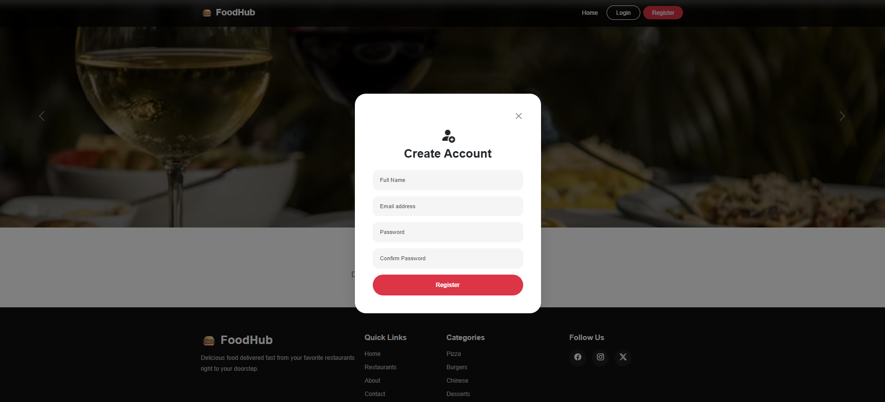 |

| Login                                | Dashboard                                    |
| ------------------------------------ | -------------------------------------------- |
| 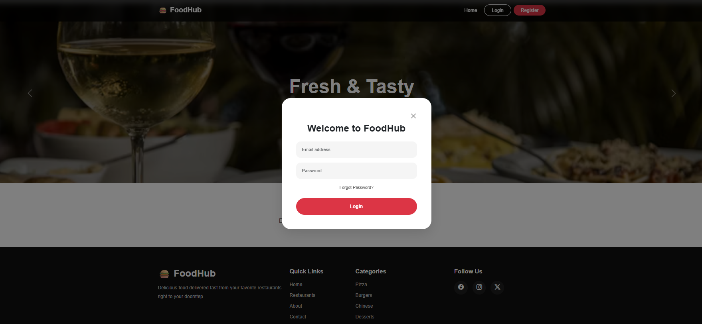 | 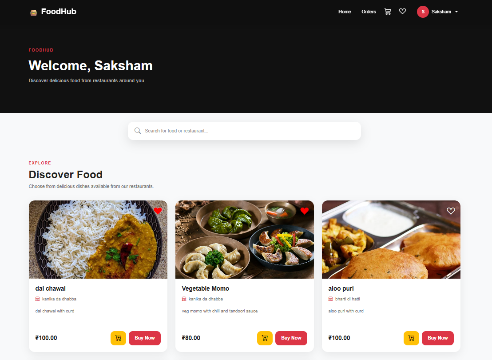 |

| Profile                                  | Cart                               |
| ---------------------------------------- | ---------------------------------- |
| 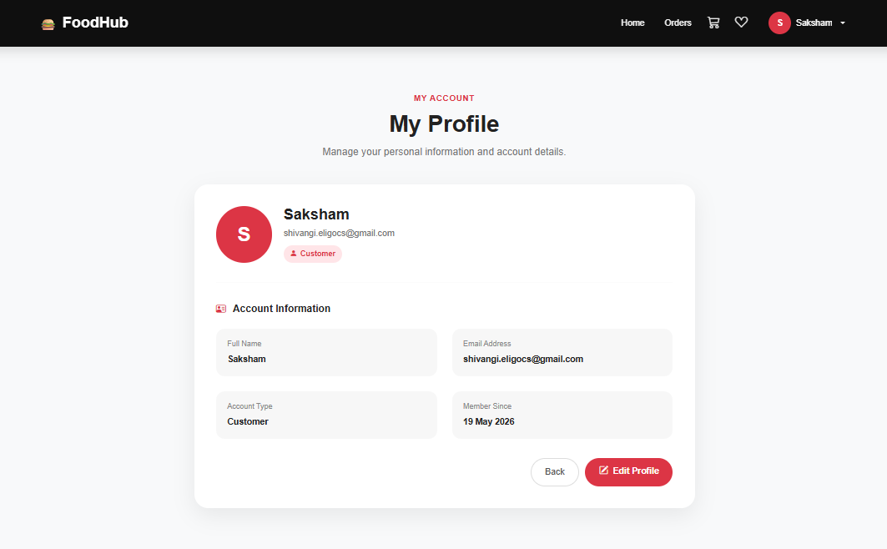 |  |

| Wishlist                                   | Checkout                                   |
| ------------------------------------------ | ------------------------------------------ |
|  | 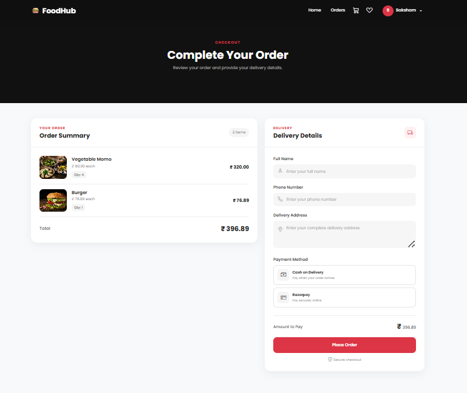 |

| My Orders                                  | Navigation                                           |
| ------------------------------------------ | ---------------------------------------------------- |
|  | 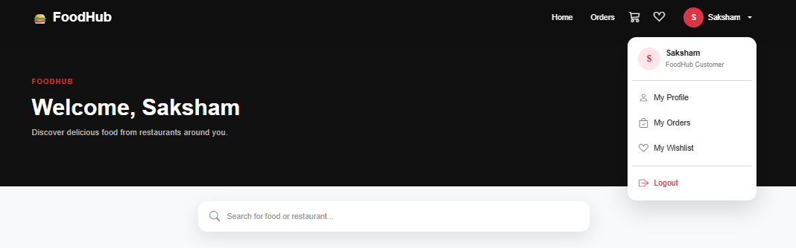 |

---

### 🏪 Restaurant

| Dashboard                                          | Complete Profile                                                          |
| -------------------------------------------------- | ------------------------------------------------------------------------- |
|  | 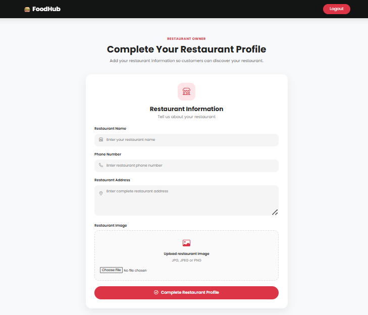 |

| Add Food                                        | Manage Food                                       |
| ----------------------------------------------- | ------------------------------------------------- |
| 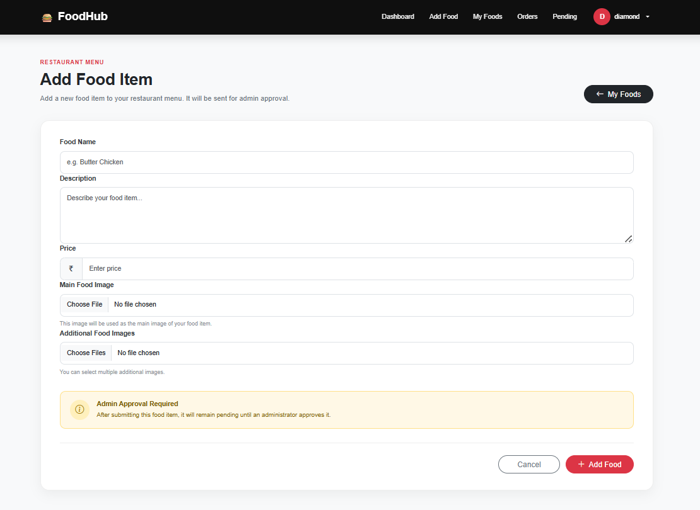 |  |

| Edit Profile                                            | Pending Food                                            |
| ------------------------------------------------------- | ------------------------------------------------------- |
| 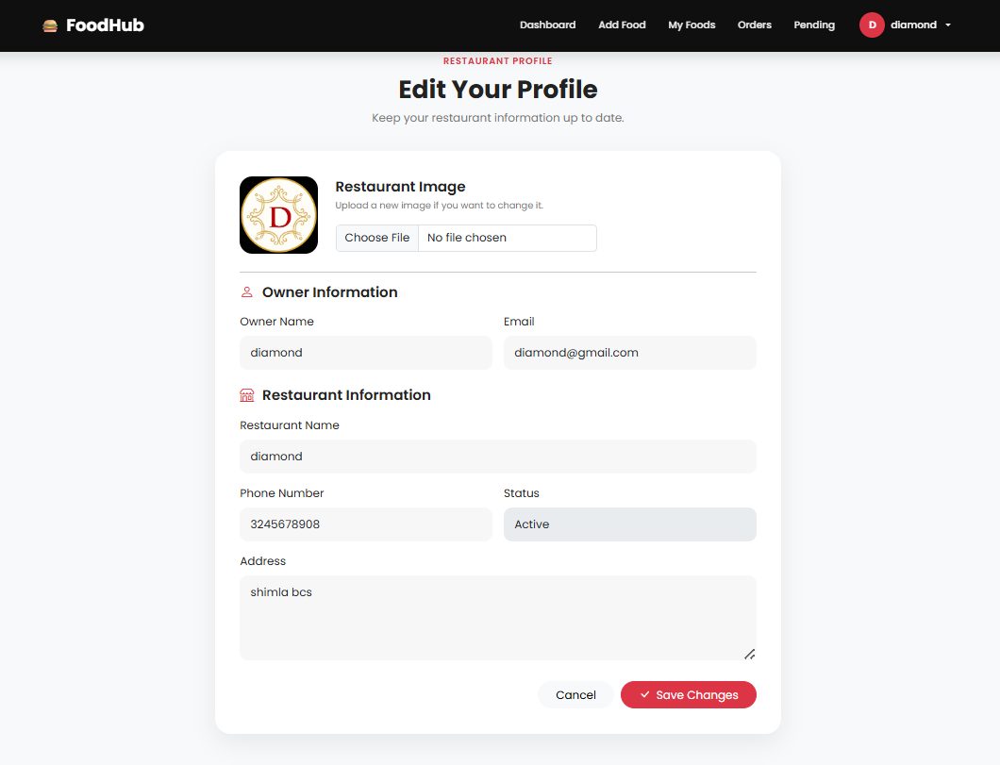 | 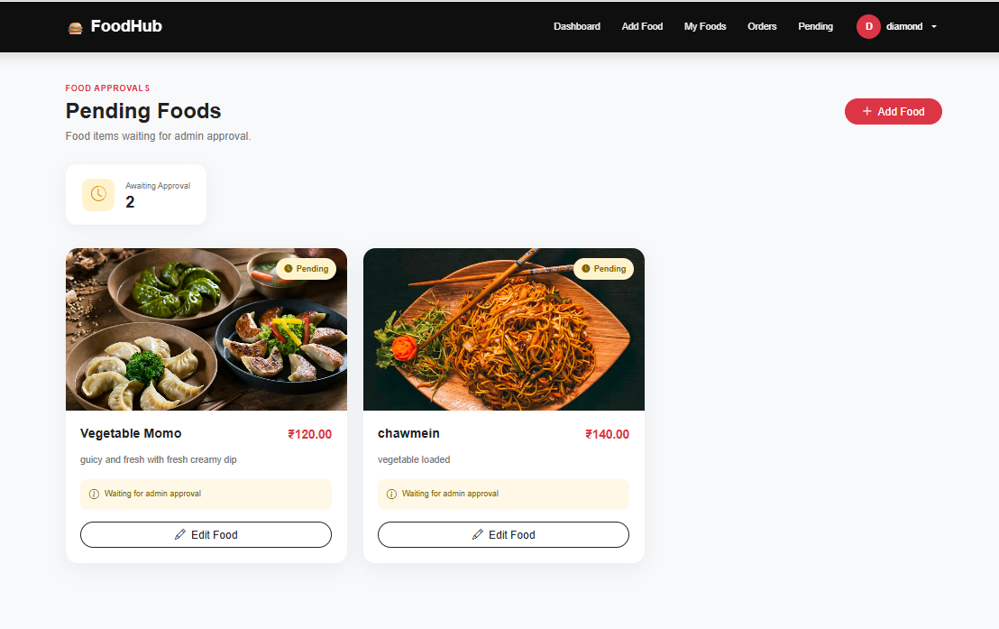 |

| Orders                                      | Order Details                                             |
| ------------------------------------------- | --------------------------------------------------------- |
|  |  |

---

### 🛡️ Admin

| Dashboard                                     | Add Restaurant                                          |
| --------------------------------------------- | ------------------------------------------------------- |
|  | 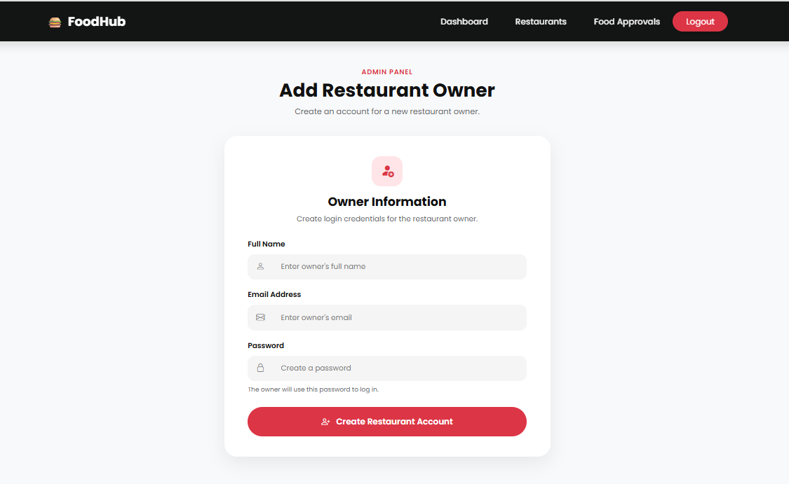 |

| Manage Restaurants                                             | Restaurant View                                           |
| -------------------------------------------------------------- | --------------------------------------------------------- |
|  |  |

| Food Approval                                         |
| ----------------------------------------------------- |
|  |

---

## 🔐 Key Implementation Details

| Area                  | Implementation                                       |
| --------------------- | ---------------------------------------------------- |
| Authentication        | Session-based authentication                         |
| Authorization         | Role-based access for Customer, Restaurant and Admin |
| Database              | MySQL with PDO                                       |
| Security              | PDO prepared statements                              |
| Food Management       | CRUD operations                                      |
| Restaurant Management | Restaurant creation and management                   |
| Approval System       | Admin food approval workflow                         |
| Cart                  | Quantity management and cart operations              |
| Wishlist              | Food wishlist management                             |
| Orders                | Orders and order-item relationships                  |
| Payments              | COD and Razorpay flow                                |
| Uploads               | Food and restaurant image uploads                    |
| Password Recovery     | Password reset workflow                              |

---

## 💳 Payment Flow

### Cash on Delivery

```text
Checkout
   ↓
Select COD
   ↓
Create Order
   ↓
Order Success
```

### Razorpay

```text
Checkout
   ↓
Select Razorpay
   ↓
Payment Flow
   ↓
Payment Details
   ↓
Create Order
```

> ⚠️ Payment credentials, database credentials, SMTP credentials, API keys and other secrets must never be committed to GitHub.

---

## ⚙️ Local Setup

### Prerequisites

* XAMPP
* Apache
* MySQL
* PHP
* Git
* Web browser

### 1. Clone Repository

```bash
git clone https://github.com/ranashivangi43-maker/FoodHub.git
```

### 2. Move Project

Place the project inside the XAMPP `htdocs` directory.

Example:

```text
C:\xampp\htdocs\PHP\Restaurant
```

### 3. Start XAMPP

Start:

```text
Apache
MySQL
```

### 4. Create Database

Open:

```text
http://localhost/phpmyadmin
```

Create the required database and import the project database schema.

### 5. Configure Database

Update the local database credentials in:

```text
config/db.php
```

Do not commit real credentials to GitHub.

### 6. Run Application

Open:

```text
http://localhost/PHP/Restaurant/
```

---

## 🧪 Main Testing Workflows

### Customer

```text
Register
   ↓
Login
   ↓
Browse Food
   ↓
Cart / Wishlist
   ↓
Checkout
   ↓
Payment Method
   ↓
Place Order
   ↓
My Orders
```

### Restaurant

```text
Login
   ↓
Complete Profile
   ↓
Manage Food
   ↓
View Orders
   ↓
Order Details
   ↓
Update Order Status
```

### Admin

```text
Login
   ↓
Dashboard
   ↓
Manage Restaurants
   ↓
Review Food Requests
   ↓
Approve / Reject Food
   ↓
View Orders
```

---

## 🔒 Security & Configuration

The repository uses `.gitignore` to prevent sensitive and local-development files from being committed.

Typical ignored files include:

```text
.env
.env.*
*.sql
*.sqlite
*.db
*.log
.vscode/
.idea/
```

Local configuration files containing credentials should remain on the development machine.

---

## 🚀 Future Improvements

* 🔔 Customer and restaurant notifications
* 📍 Live order tracking
* ⭐ Ratings and reviews
* 🔎 Advanced food search and filtering
* 📊 Restaurant analytics
* 🛵 Delivery partner module
* 🔐 Stronger server-side payment verification
* ☁️ Production deployment
* 📈 Advanced reporting and analytics

---

## 🎯 Project Purpose

FoodHub was developed as a practical portfolio project to demonstrate:

**Core PHP · MySQL · PDO · Authentication · Role-Based Access Control · CRUD · Database Relationships · Cart & Wishlist · Order Processing · Payment Integration · File Uploads**

---

## 👩‍💻 Author

**Shivangi Rana**

GitHub: [@ranashivangi43-maker](https://github.com/ranashivangi43-maker)

---

